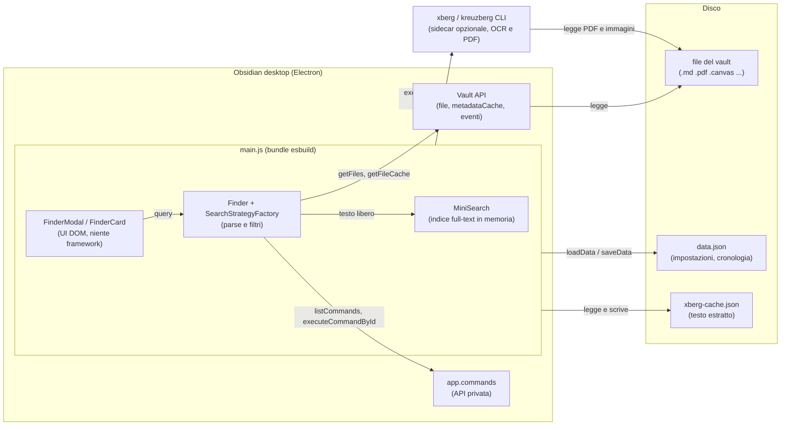
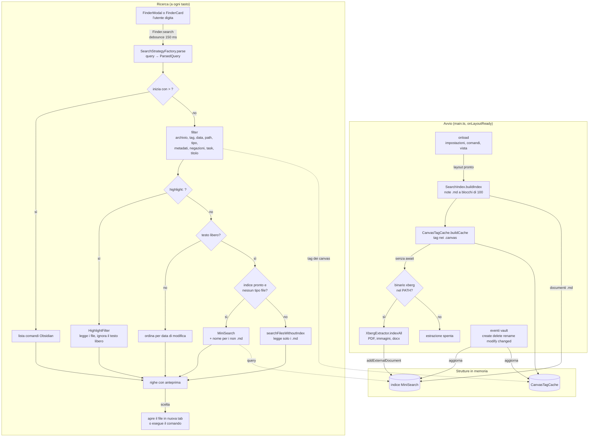

# Panoramica Architettura

Com'è fatto il plugin, dove gira, cosa succede da quando l'utente scrive una query a quando apre un file. I dettagli di ogni passo stanno nei capitoli dei flussi, linkati sezione per sezione.

## Descrizione generale

Better Finder è un plugin Obsidian scritto in TypeScript: un solo bundle `main.js` che Obsidian carica dentro la sua finestra Electron. Non c'è backend. Tutto gira nel processo dell'app e lavora sui file del vault attraverso le API di Obsidian. L'unica eccezione è un binario esterno opzionale, Xberg, che il plugin lancia come processo figlio per estrarre il testo da PDF e immagini. `main.ts` righe 70-83

L'idea del prodotto è una casella sola. L'utente scrive una **query** che mescola filtri (`#spring`, `created:this-week`, `pdf`, `-image`, `author:rossi`) e testo libero, e ottiene file del vault o comandi Obsidian. Il glossario del dominio è in `CONTEXT.md`, ed è il documento del repo più allineato al codice. `CONTEXT.md` righe 10-19

Il codice è diviso in tre strati con dipendenze in un verso solo:

- **ciclo di vita** (`main.ts`): registra comandi e viste, costruisce indice e cache, aggancia gli eventi del vault;
- **motore** (`src/Finder.ts`, `src/engine/`): parse della query, filtri, ricerca full-text;
- **interfaccia** (`src/FinderModal.ts`, `src/FinderCard.ts`, `src/component/`): due UI che usano lo stesso `Finder`.

I dati vivono quasi tutti in memoria. L'indice full-text è ricostruito a ogni avvio. Su disco ci sono due file: `data.json` con impostazioni e cronologia, gestito da Obsidian, e `xberg-cache.json` con il testo estratto dai PDF. Non c'è un capitolo dedicato ai dati: le strutture si raccontano nel [flusso di indicizzazione](./03-flusso-indicizzazione.md).

Il plugin legge il vault con i permessi dell'utente e non ha scelte di sicurezza trasversali. I punti delicati sono due. Il plugin usa API private di Obsidian (`app.commands`, `app.hotkeyManager`) con cast `as any`, che possono cambiare senza preavviso. Inoltre lancia un eseguibile trovato nel `PATH` con `child_process.execFile`. `src/Finder.ts` righe 67-80

## Struttura del repository

Il repo è lo scaffolding di `obsidianmd/obsidian-sample-plugin` cresciuto sul posto. Vive dentro `.obsidian/plugins/` del vault dell'autore, così `npm run dev` ricompila direttamente nella cartella che Obsidian carica.

```
obsidian-better-finder/
├── main.ts                    → entry point del plugin (l'unico che esbuild legge)
├── src/
│   ├── Finder.ts              → orchestratore della ricerca, condiviso dalle due UI
│   ├── FinderModal.ts         → UI principale: modale da tastiera
│   ├── FinderCard.ts          → UI secondaria: vista laterale a card
│   ├── SearchUIHelper.ts      → hint bar, autocomplete tag, valori data (comuni alle UI)
│   ├── FinderSetting.ts       → tab delle impostazioni
│   ├── const.ts               → stringhe UI in italiano
│   ├── engine/                → motore: factory dei filtri, indice, cache, cronologia
│   │   └── search-filters/    → un file per filtro + types.ts (ParsedQuery, SearchFilter)
│   ├── component/             → componenti DOM (Modal/, Card/, ui/, interface/)
│   ├── main.ts                → CODICE MORTO: plugin di esempio del template
│   └── settings.ts            → CODICE MORTO: settings di esempio del template
├── test/                      → test Jest della logica pura, con mock di obsidian e minisearch
├── docs/                      → questa wiki e le istruzioni per agenti AI (docs/agents/)
├── .claude/plans/             → piani e roadmap con le decisioni prese e le alternative scartate
├── .github/workflows/lint.yml → CI: build e lint
├── esbuild.config.mjs         → bundle main.ts → main.js, CSS → styles.css
├── manifest.json              → metadati letti da Obsidian (id, versione, minAppVersion)
├── styles.css                 → ARTEFATTO di build, tracciato in git
├── CONTEXT.md                 → glossario del dominio
├── spec.md, README.md, TODO   → note di progetto, in parte superate (vedi sotto)
└── package.json               → script npm, una sola dipendenza runtime (minisearch)
```

**⚠️ Trappola**: esistono due `main.ts`. Quello vero è in radice: è l'unico `entryPoints` di esbuild. `src/main.ts` e `src/settings.ts` vengono dal template, non li importa nessuno, ma `tsc` li compila lo stesso perché `tsconfig.json` include `**/*.ts`. Se modifichi `src/main.ts` non succede niente. `esbuild.config.mjs` righe 29-33

## Glossario tecnologico

Lo stack è piccolo: un plugin Obsidian, una libreria di ricerca e un binario opzionale. Il diagramma mostra dove gira ogni pezzo.



### Stack a colpo d'occhio

| Tecnologia | Cos'è in 1 riga | Ruolo in questo progetto | Approfondimento |
|---|---|---|---|
| Obsidian API 1.12.3 | Le classi che un plugin estende (`Plugin`, `SuggestModal`, `ItemView`) e i servizi dell'app (vault, metadataCache) | Tutto: UI, lettura file, eventi, tag e frontmatter già parsati | [Interfaccia](./06-interfaccia.md) |
| TypeScript 4.7.4 | JavaScript con tipi statici | Linguaggio unico; `tsc` fa solo type-check, il bundle lo fa esbuild | - |
| esbuild 0.17.3 | Bundler JavaScript molto veloce | Produce `main.js` (CommonJS) e rinomina il CSS in `styles.css` | [La build](./05-ci-cd.md#la-build) |
| MiniSearch 7.2 | Libreria di ricerca full-text in memoria, senza server | Unica dipendenza runtime: indicizza titolo e contenuto delle note | [Indice](./03-flusso-indicizzazione.md#2-lindice-minisearch-si-costruisce-a-blocchi-di-100-note) |
| Xberg (ex kreuzberg) CLI | Programma a riga di comando che estrae testo da PDF, Office e immagini (OCR) | Sidecar opzionale: se manca, la ricerca nei PDF è spenta in silenzio | [Xberg](./03-flusso-indicizzazione.md#4-xberg-estrae-il-testo-di-pdf-immagini-e-office) |
| Jest + ts-jest 29 | Test runner per TypeScript | Test della logica pura con `obsidian` e `minisearch` finti | [Testarlo con Jest](./07-aggiungere-un-filtro.md) |
| ESLint 8 + Prettier 3 | Linter e formattatore | Regole di stile; il lint gira in CI | [CI/CD](./05-ci-cd.md) |
| GitHub Actions | CI di GitHub | Build e lint su Node 20 e 22 a ogni push | [I job](./05-ci-cd.md#i-job) |

## Il giro completo

Il plugin ha due giri che si incontrano nell'indice: l'avvio, che costruisce le strutture di ricerca, e la ricerca, che le usa a ogni tasto.



**Come leggerlo**:

1. **Avvio.** `onload` registra comandi, vista laterale e impostazioni. Il lavoro pesante parte solo a layout pronto, per non rallentare l'apertura di Obsidian. L'indice delle note si costruisce prima, poi la cache dei tag dei canvas. L'estrazione Xberg parte senza `await` e può finire minuti dopo. Racconto completo in [Indicizzazione all'avvio](./03-flusso-indicizzazione.md). `main.ts` righe 70-83
2. **Strutture in memoria.** L'indice MiniSearch contiene le note e il testo estratto da Xberg. La [CanvasTagCache](./03-flusso-indicizzazione.md#3-i-tag-dei-canvas-vanno-in-cache) esiste perché Obsidian non estrae i tag dai `.canvas`. Cinque tipi di evento le tengono allineate.
3. **Dalla query alla [ParsedQuery](./02-flusso-ricerca.md#2-la-query-diventa-una-parsedquery).** Ogni filtro estrae il suo token e lo toglie dal testo; quello che resta è testo libero. Il prefisso `>` porta in [command mode](./04-sintassi-query.md#comandi-obsidian) e salta tutto il resto.
4. **Filtri, poi testo libero.** I filtri restringono la lista dei file con dati che Obsidian ha già in cache (tag, frontmatter, date, estensione). Solo dopo il testo libero passa dall'indice o dal fallback. Dettaglio in [Ricerca dalla modale](./02-flusso-ricerca.md). `src/Finder.ts` righe 82-99
5. **Rendering e scelta.** La modale decide anteprima e snippet per ogni riga; la scelta apre il file in una nuova tab. Le due UI sono descritte in [Interfaccia](./06-interfaccia.md).

**⚠️ Trappola**: un tipo file esplicito nella query [spegne l'indice](./02-flusso-ricerca.md#4-il-testo-libero-passa-dallindice).

Lo schema del flusso dati in `spec.md` è superato. Le differenze con il codice:

| Nello schema (`spec.md` righe 27-46) | Nel codice |
|---|---|
| Filtri applicati in ordine tag, data, path, tipo, task, titolo | Prima l'esclusione di `#archive`; ci sono anche metadati e negazioni (`src/engine/SearchStrategy.ts` righe 62-102) |
| "Se index pronto e solo markdown → SearchIndex.search()" | L'indice si usa quando la query **non** ha tipi file espliciti, e contiene anche PDF e immagini estratti |
| Parse estrae tag, date, tipi, scope, task, path | Estrae anche negazioni (per prime), `highlight:` e metadati `chiave:valore` (per ultimi) |

## Componenti principali

- **`ObsidianBetterFinder`** (`main.ts`): ciclo di vita del plugin; registra i [comandi del plugin](./04-sintassi-query.md#comandi-del-plugin), la vista, il ribbon e il tab delle [impostazioni](./04-sintassi-query.md#impostazioni), poi aggancia gli eventi del vault.
- **`Finder`** (`src/Finder.ts`): orchestratore con debounce, lista file in cache, command mode, dedup, export e apertura del risultato. Ogni UI aperta ne crea una sua istanza.
- **[`SearchStrategyFactory`](./07-aggiungere-un-filtro.md#registrarlo-nella-factory)** (`src/engine/SearchStrategy.ts`): singleton che registra i filtri e possiede `parse`, `filter` e `filterFreeText`.
- **Filtri** (`src/engine/search-filters/`): una classe per filtro, ognuna sottoclasse di [`SearchFilter`](./07-aggiungere-un-filtro.md#anatomia-di-un-filtro). La sintassi che riconoscono è in [Sintassi della query](./04-sintassi-query.md).
- **`SearchIndex`** (`src/engine/SearchIndex.ts`): singleton attorno a MiniSearch, con il fallback che legge i file quando l'indice non si può usare.
- **`CanvasTagCache`** e **`XbergExtractor`** (`src/engine/`): cache ausiliarie per i tag dei canvas e il testo dei PDF.
- **[`SearchHistory`](./06-interfaccia.md#cronologia-delle-ricerche)** (`src/engine/SearchHistory.ts`): ultime 20 query che hanno portato ad aprire qualcosa.
- **[`FinderModal`](./06-interfaccia.md#la-modale-di-ricerca)** e **[`FinderCard`](./06-interfaccia.md#la-vista-laterale)**: le due UI. `SearchUIHelper` monta la hint bar comune.
- **Componenti DOM** (`src/component/`): `ModalUI`, `ModalItem`, `CardUI`, `GridCard`, `ListCard` e gli atomi in `ui/`: anteprime, snippet, chip. Il contratto fra UI e componenti è l'interfaccia `Card`.

## Pattern architetturali rilevati

- **Strategy con parse incorporato.** Ogni filtro ha tre metodi: `extract` legge il proprio token, `removeFrom` lo toglie dalla query, `filter` restringe i file. `parse` li chiama a cascata, e ognuno vede il testo già ripulito dai precedenti. I filtri si estraggono in un ordine e si applicano in un altro. È il punto che si sbaglia più spesso, spiegato in [Aggiungere un filtro](./07-aggiungere-un-filtro.md). `src/engine/SearchStrategy.ts` righe 209-231
- **Singleton con `getInstance()`.** `SearchStrategyFactory`, `SearchIndex`, `CanvasTagCache`, `XbergExtractor` e `SearchHistory`. Sono condivisi da modale, vista laterale e filtri senza passarli per costruttore. Il costo: `onunload` è vuoto, quindi disabilitare il plugin non li libera. Nei test bisogna azzerare `_instance` a mano. `main.ts` righe 186-188
- **Lista invalidata da eventi.** `Finder` non chiama `getFiles()` a ogni tasto: tiene la lista e la segna sporca su create, delete e rename. Il commento spiega che ricalcolarla causava blocchi su vault grandi. `src/Finder.ts` righe 20-57
- **Lavoro a blocchi con cessione all'event loop.** `buildIndex` indicizza 100 note per volta con un `setTimeout(0)` fra i blocchi; il fallback legge i file a blocchi di 50 in parallelo. Entrambi esistono per non congelare la UI di Obsidian, che gira sullo stesso thread.
- **Sidecar con degrado silenzioso.** `XbergExtractor` prova `xberg` e poi `kreuzberg` con `--version`; se nessuno risponde, si disattiva senza errori visibili. `src/engine/XbergExtractor.ts` righe 50-71
- **Renderer stupidi.** `FinderModal.renderResult` decide cosa mostrare (anteprima sì o no, snippet, task) e passa a `ModalUI` un oggetto `Card` già deciso. `ModalUI` disegna e basta. `src/FinderModal.ts` righe 84-102

### Discrepanze fra CLAUDE.md e codice

**⚠️ Trappola**: `CLAUDE.md` dice cose che il codice non fa più. Non fidarti di quel file senza controllare:

| `CLAUDE.md` | Nel codice |
|---|---|
| Riga 101: la modale passa una callback `renderPreview: (el) => void` | `renderPreview` è un booleano (`src/component/interface/Card.ts` riga 11) |
| Riga 111: `SuggestModal` richiede `renderModalItem` | L'abstract di Obsidian 1.12.3 è `renderSuggestion`; `src/FinderModal.ts` righe 62-68 implementa entrambi e `renderModalItem` non lo chiama nessuno |
| Riga 83: filtri data `today`, `this week` | Servono `created:` o `modified:` davanti ([date](./04-sintassi-query.md#date)) |
| Riga 40: `FinderCard` è legacy | Ha funzioni che la modale non ha ([vista laterale](./06-interfaccia.md#la-vista-laterale)) |

## Ambienti

Il plugin non ha ambienti di deploy. Gira nel vault di chi lo installa.

| Ambiente | Branch CI | Database | Note |
|---|---|---|---|
| Sviluppo | qualsiasi (`feature/*`, `develop`) | nessuno; `data.json` locale | `npm run dev` ricompila in watch dentro `.obsidian/plugins/obsidian-better-finder/`; il plugin Hot Reload lo ricarica (`README.md` righe 61-75) |
| Uso | `master` | nessuno | `main.js`, `manifest.json` e `styles.css` copiati nella cartella del plugin del vault |

**⚠️ Trappola**: su mobile il plugin [probabilmente non parte](./03-flusso-indicizzazione.md#4-xberg-estrae-il-testo-di-pdf-immagini-e-office), per via di `child_process`.

## Pipeline di deploy

La CI è un solo workflow GitHub Actions che fa build e lint su Node 20 e 22, senza lanciare i test. Il rilascio è manuale: `npm version` aggiorna `manifest.json` e `versions.json`, e `main.js` va caricato a mano. Tutto il resto è in [CI/CD](./05-ci-cd.md).

## File chiave

| File | Ruolo |
|---|---|
| `main.ts` | Entry point: registrazioni, costruzione di indice e cache, tutti gli handler degli eventi del vault |
| `src/Finder.ts` | Punto d'ingresso della ricerca per entrambe le UI (`search`, `getResults`, `openResult`) |
| `src/engine/SearchStrategy.ts` | I due ordini dei filtri (`parse` e `filter`) e la scelta fra indice e fallback (`filterFreeText`) |
| `src/engine/search-filters/types.ts` | `ParsedQuery` e la classe base dei filtri: il contratto da rispettare per aggiungerne uno |
| `src/engine/SearchIndex.ts` | Configurazione di MiniSearch (pesi, fuzzy, prefix) e fallback senza indice |
| `src/FinderModal.ts` | La UI principale e la politica delle anteprime |
| `CONTEXT.md` | Glossario del dominio, allineato al codice |
| `.claude/plans/roadmap-better-finder.md` | Decisioni prese e alternative scartate (es. Xberg come sidecar invece di NAPI o WASM) |

## File di configurazione

| File | Scopo |
|---|---|
| `manifest.json` | Metadati per Obsidian: id `obsidian-better-finder`, versione, `minAppVersion`. In git. La `description` è ancora quella del template |
| `package.json` | Script npm (`dev`, `build`, `lint`, `test`, `version`) e dipendenze. In git. Nome e descrizione sono ancora quelli del template |
| `esbuild.config.mjs` | Bundle di produzione e watch di sviluppo; rinomina `main.css` in `styles.css`. In git |
| `tsconfig.json` | Opzioni di `tsc`; include `**/*.ts`, quindi anche test e file morti. In git |
| `jest.config.js` | Test in `test/`, con `obsidian`, `minisearch` e i `.css` sostituiti da mock. In git |
| `.eslintrc` | Regole ESLint usate da `npm run lint`. In git. `eslint.config.mts` importa pacchetti non installati: probabilmente morto |
| `.github/workflows/lint.yml` | Workflow della CI. In git |
| `versions.json` | Mappa versione del plugin → versione minima di Obsidian. In git |
| `data.json` | Impostazioni e cronologia, scritto da Obsidian. **Non** in git (`.gitignore`) |
| `xberg-cache.json` | Testo estratto dai PDF, scritto dal plugin con percorso fisso `.obsidian/plugins/obsidian-better-finder/`. Non è in `.gitignore`: può finire in git o nel backup del vault |
