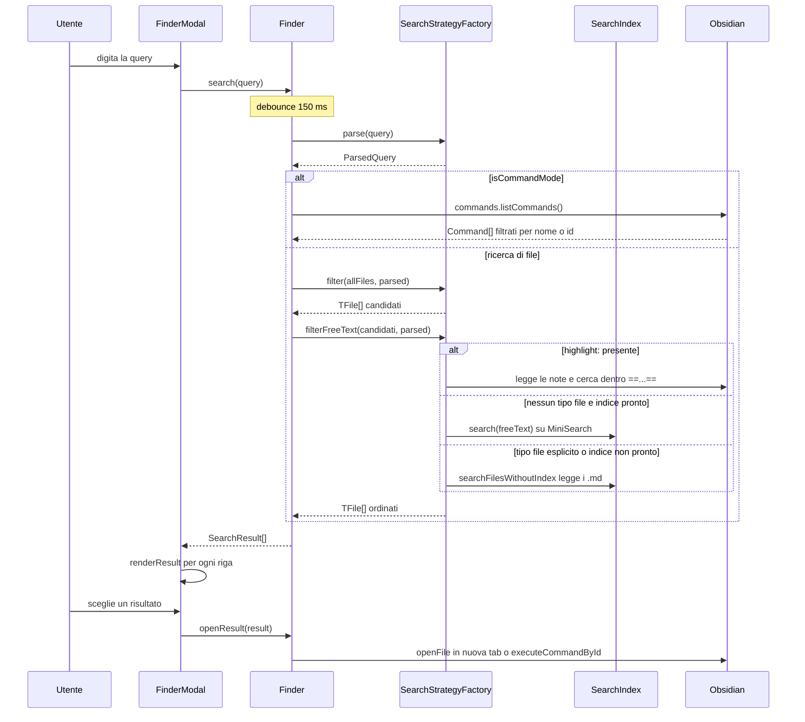

# Flusso: ricerca dalla modale

L'utente apre la modale con il comando [Open Better Finder Modal](./04-sintassi-query.md#comandi-del-plugin) e scrive una query che mescola filtri e testo libero, per esempio `#spring -image created:this-week author:rossi architettura`. Ottiene una lista di file del vault (o di comandi Obsidian, se la query inizia con `>`), con anteprima, e apre quello che sceglie.

Questo capitolo ti serve quando un risultato manca o compare dove non dovrebbe, o quando devi toccare il motore di ricerca. La [vista laterale](./06-interfaccia.md#la-vista-laterale) usa lo stesso motore (`Finder`): cambia solo il rendering. La sintassi dei singoli filtri è in [Sintassi della query](./04-sintassi-query.md); come si costruisce l'indice è in [Indicizzazione](./03-flusso-indicizzazione.md).



## 1. Digiti nella modale e parte la ricerca

`FinderModal` è una `SuggestModal` di Obsidian: a ogni tasto Obsidian chiama `getSuggestions`, che passa la query a `Finder.search`. `Finder` è l'orchestratore condiviso dalle due UI; ne esiste un'istanza per ogni modale o vista aperta. La ricerca parte solo dopo 150 ms senza tasti:

```typescript
async search(query: string): Promise<SearchResult[]> {
  if (this.debounceTimer !== null) {
    clearTimeout(this.debounceTimer);
  }

  return new Promise<SearchResult[]>((resolve) => {
    this.debounceTimer = window.setTimeout(async () => {
      this.debounceTimer = null;
      const results = await this.getResults(query);

      this.lastResultCount = results.length;
      resolve(results);
    }, Finder.DEBOUNCE_MS);
  });
}
```

`src/Finder.ts` righe 141-155

**⚠️ Trappola.** Un tasto che arriva prima dei 150 ms cancella il timer precedente, ma la Promise di quella chiamata resta appesa per sempre: nessuno la risolve né la rifiuta. Nella modale sembra innocuo perché Obsidian usa solo l'ultima risposta, ma non è verificato. Se aggiungi codice che fa `await` su `search` aspettandosi una risposta per ogni chiamata, si blocca.

`getResults` è il giro completo: parse, ritorno anticipato per i comandi, filtri, testo libero e dedup per path. Il dedup tiene la prima occorrenza, quella con il ranking più alto. La lista dei file del vault non si rilegge a ogni tasto. `Finder` la tiene in cache e la segna sporca sugli eventi `create`, `delete` e `rename`: ricostruirla a ogni ricerca contribuiva al freeze sui vault grandi. `dispose()` stacca i listener quando la modale si chiude. `src/Finder.ts` righe 20-57 e 82-99

## 2. La query diventa una ParsedQuery

`SearchStrategyFactory.parse` trasforma la stringa in una `ParsedQuery`, la struttura che tutto il resto del flusso legge. Ogni filtro riconosce il suo token con `extract` e lo toglie dal testo con `removeFrom`. La factory li chiama in cascata e ognuno vede il testo già ripulito dai precedenti. Quello che resta alla fine è il testo libero. Le regole per scrivere un filtro sono nella guida [Aggiungere un filtro](./07-aggiungere-un-filtro.md#anatomia-di-un-filtro).

La struttura è questa:

```typescript
export interface ParsedQuery {
  rawInput: string;
  isCommandMode: boolean;
  commandText?: string;
  tags: string[];
  dateFilter?: DateRange;
  fileTypes: string[];
  scope?: 'title' | 'content';
  taskFilter?: 'all' | 'todo' | 'done';
  pathFilter?: string;
  highlightFilter?: string;
  negations?: { extensions: string[]; tags: string[] };
  metadataFilters?: Array<{ key: string; value: string }>;
  freeText: string;
}
```

`src/engine/search-filters/types.ts` righe 4-18

Per la query `#spring -image created:this-week author:rossi architettura` il risultato è questo. I campi `scope`, `taskFilter`, `pathFilter` e `highlightFilter` restano `undefined`:

```json
{
  "rawInput": "#spring -image created:this-week author:rossi architettura",
  "isCommandMode": false,
  "negations": { "extensions": ["png", "jpg", "jpeg", "gif", "webp"], "tags": [] },
  "tags": ["#spring"],
  "dateFilter": { "field": "created", "value": "this-week" },
  "fileTypes": [],
  "metadataFilters": [{ "key": "author", "value": "rossi" }],
  "freeText": "architettura"
}
```

`-image` diventa le cinque estensioni delle immagini, secondo la tabella `KEYWORD_EXTENSIONS` del [filtro di negazione](./04-sintassi-query.md#negazione). `src/engine/search-filters/NegationFilter.ts` righe 11-21

L'ordine di estrazione conta; il perché è nella guida, in [I due ordini](./07-aggiungere-un-filtro.md#i-due-ordini-estrazione-e-applicazione).

**⚠️ Trappola.** `title:` non toglie il termine dalla query. `TitleFilter.removeFrom` rimuove solo il prefisso, e la parola resta nel testo libero: con `title:docker` il campo `freeText` vale `docker`. Il passo 4 la ricerca di nuovo, questa volta nel contenuto. `src/engine/search-filters/TitleFilter.ts` righe 25-28

## 3. I filtri restringono i file del vault

`SearchStrategyFactory.filter` parte da tutti i file del vault (non solo le note markdown) e applica i filtri presenti nella `ParsedQuery`. L'ordine di applicazione è diverso da quello di estrazione:

```typescript
results = archiveStrategy.excludeArchived(results, parsed.tags, app);

if (parsed.tags.length > 0) {
  results = this.applyStrategy('tag', results, parsed.tags, app);
}

if (parsed.dateFilter) {
  results = this.applyStrategy(parsed.dateFilter.field, results, parsed.dateFilter, app);
}

// Path filter prima del file type filter, così lavora su tutti i file
if (parsed.pathFilter) {
  results = this.applyStrategy('path', results, parsed.pathFilter, app);
}

results = this.applyFileTypes(results, parsed, app);
// ...
```

`src/engine/SearchStrategy.ts` righe 62-83

Dopo i tipi file vengono metadati, negazioni, task e infine lo scope titolo. `src/engine/SearchStrategy.ts` righe 85-101

Il primo passaggio gira sempre, anche senza tag nella query: le note con [`#archive`](./04-sintassi-query.md#archivio) spariscono, a meno che la query non chieda `#archive`. Ogni filtro riceve la lista ridotta dal precedente, quindi l'ordine decide le prestazioni, non quali file restano. Alcuni filtri cambiano anche l'ordine della lista: il [filtro data](./04-sintassi-query.md#date) ordina per data decrescente, lo scope titolo per punteggio sul nome.

**⚠️ Trappola.** Il commento "Skip del default markdown-only quando il path filter è attivo" descrive un default che non esiste. `FileTypeFilter.filter` con lista vuota restituisce già tutti i file, quindi la sostituzione con `['*']` non cambia niente: è un residuo. Non costruirci sopra. `src/engine/SearchStrategy.ts` righe 127-133

## 4. Il testo libero passa dall'indice

`filterFreeText` decide come cercare il testo libero fra i candidati rimasti. Le strade sono quattro:

| Condizione | Cosa succede |
|---|---|
| `highlight:` nella query | filtro asincrono che legge le note e cerca dentro `==...==`; il testo libero viene **ignorato** |
| niente testo libero | i candidati, ordinati per data di modifica decrescente, senza limite |
| nessun tipo file esplicito e indice pronto | ricerca nell'[indice MiniSearch](./03-flusso-indicizzazione.md#2-lindice-minisearch-si-costruisce-a-blocchi-di-100-note), più ricerca per nome sui file non markdown che l'indice non ha trovato |
| altrimenti | fallback che legge i file uno per uno |

Il ramo con l'indice è questo:

```typescript
const searchIndex = SearchIndex.getInstance(app);
const hasExplicitFileTypes = parsed.fileTypes.length > 0;

// No explicit file type filter: use MiniSearch (markdown + documenti esterni
// tipo PDF/OCR) + basename search per i file non indicizzati
if (!hasExplicitFileTypes && searchIndex.isIndexReady()) {
  const candidatePaths = new Set(files.map(f => f.path));
  const indexResults = searchIndex.search(parsed.freeText).filter(f => candidatePaths.has(f.path));
  const foundPaths = new Set(indexResults.map(f => f.path));
  const remainingNonMd = files.filter(f => f.extension !== 'md' && !foundPaths.has(f.path));
  const otherResults = searchIndex.searchInTitlesWithoutIndex(parsed.freeText, remainingNonMd);

  return [...indexResults, ...otherResults];
}

return searchIndex.searchFilesWithoutIndex(parsed.freeText, files);
```

`src/engine/SearchStrategy.ts` righe 160-175

L'indice cerca su tutto il vault; i filtri del passo 3 entrano solo come intersezione sui path. MiniSearch:

- richiede tutte le parole (AND);
- dà peso 5 al nome del file;
- usa il fuzzy solo per parole di almeno 6 caratteri;
- usa il prefisso solo sull'ultima parola, quella che stai ancora scrivendo.

`src/engine/SearchIndex.ts` righe 23-36

Il fallback dà 10 punti se il testo è nel nome del file e un punto per ogni occorrenza nel contenuto. Lavora a blocchi di 50 file letti in parallelo. Si usa anche nei primi secondi dopo l'avvio, finché l'indice non è pronto.

**⚠️ Trappola.** Un tipo file esplicito spegne l'indice. Con `pdf contratto` la query ha `fileTypes: ["pdf"]` e passa dal fallback. Il fallback però legge il contenuto **solo dei file `.md`**. Il testo dei PDF estratto da [Xberg](./03-flusso-indicizzazione.md#4-xberg-estrae-il-testo-di-pdf-immagini-e-office) vive solo nell'indice. Risultato: con `pdf contratto` un PDF si trova solo se "contratto" è nel nome del file. Con `contratto` da solo lo trovi anche per contenuto. Vale per ogni tipo file nella query (`pdf`, `image`, `canvas`, `docx`...): la condizione è solo `hasExplicitFileTypes`. `src/engine/SearchStrategy.ts` righe 173-177 e `src/engine/SearchIndex.ts` righe 299-310

**⚠️ Trappola.** Con `title:` il testo libero passa da due filtri diversi. Lo scope titolo del passo 3 usa tutto il testo libero rimasto, non solo la parola dopo `title:`, e tiene i file il cui nome lo contiene come sottostringa. Con `title:docker compose` passano solo i file il cui nome contiene `docker compose`. `src/engine/SearchStrategy.ts` righe 136-141 e `src/engine/SearchIndex.ts` righe 331-338

Poi lo stesso testo passa da MiniSearch, che cerca per prefisso di parola. `title:ook` tiene `Notebook` al passo 3 e probabilmente lo perde qui. Dedotto dal codice, non verificato a runtime.

## 5. Ogni risultato diventa una riga con anteprima

Obsidian chiama `renderSuggestion` per ogni riga, e `FinderModal.renderResult` decide cosa mostrare. La decisione sta nella modale; [`ModalUI`](./06-interfaccia.md#la-modale-di-ricerca) disegna e basta. La parte che costruisce i dati della riga:

```typescript
const file = result as TFile;
const parsed = this.getParsed(this.inputEl.value);
const fileCache = this.app.metadataCache.getFileCache(file);
const fileTags = fileCache ? getAllTags(fileCache) || [] : [];
const tasks = fileCache?.listItems?.filter(i => i.task) || [];
const doneCount = tasks.filter((t: any) => t.task === 'x' || t.task === 'X').length;
const ext = file.extension.toLowerCase();
const isExcalidraw = ext === 'md' && fileCache?.frontmatter?.['excalidraw-plugin'] === 'parsed';
const renderPreview = PREVIEW_EXTENSIONS.includes(ext) || isExcalidraw;

new ModalUI(el, this.app).render({
  file,
  tags: fileTags,
  searchedTags: parsed.tags,
  taskInfo: parsed.taskFilter ? { done: doneCount, total: tasks.length } : undefined,
  renderPreview,
  snippetTerm: ext === 'md' && parsed.freeText ? parsed.freeText : undefined,
  taskSnippet: ext === 'md' ? parsed.taskFilter : undefined,
});
```

`src/FinderModal.ts` righe 84-102

La modale ricalcola la `ParsedQuery` dal testo dell'input, perché `getSuggestions` le restituisce solo i file. Il parse è memoizzato sulla query: senza cache girava una volta per riga a ogni tasto, con un freeze sui vault con molte note. `src/FinderModal.ts` righe 14-27

Nella riga, l'estratto dei task ha la precedenza sullo snippet del testo libero. L'anteprima compare per immagini, PDF, canvas, docx, xlsx e disegni Excalidraw. Tag e badge dei task compaiono solo per le note markdown. `src/component/Modal/ModalUI.ts` righe 35-60

**⚠️ Trappola.** Lo snippet cerca il testo libero intero, letteralmente. Con `docker compose` cerca la stringa "docker compose"; MiniSearch invece trova la nota anche se le due parole sono lontane, o con un match fuzzy. In questi casi la nota è nei risultati ma senza snippet. `src/component/ui/SnippetPreview.ts` righe 18-36

## 6. La scelta apre il file o lancia il comando

Quando l'utente sceglie una riga, la modale salva la query nella [cronologia](./06-interfaccia.md#cronologia-delle-ricerche) e chiama `Finder.openResult`. `src/FinderModal.ts` righe 70-73

```typescript
openResult(result: SearchResult): void {
  if (isCommand(result)) {
    (this.app as any).commands.executeCommandById(result.id);

    return;
  }

  const file = result as TFile;

  // 'tab' apre sempre in una nuova tab invece di sostituire quella corrente.
  this.app.workspace.getLeaf('tab').openFile(file);
}
```

`src/Finder.ts` righe 188-199

Un file si apre sempre in una nuova tab. Un comando passa da `app.commands`, un'API privata di Obsidian non presente nelle typings, da cui il cast `as any`. `isCommand` distingue i due tipi controllando che il risultato abbia sia `id` sia `name`, campi che un `TFile` non ha. `src/Finder.ts` righe 9-11
