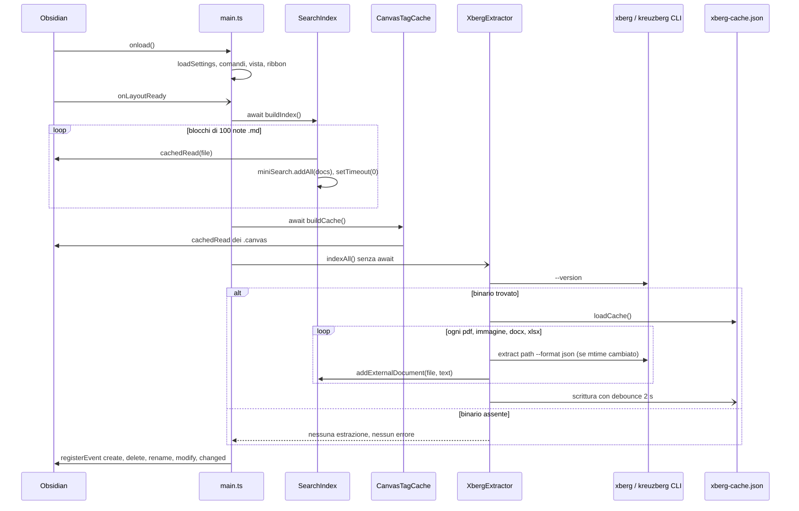

# Indicizzazione all'avvio e aggiornamento live

Quando Obsidian carica il plugin, `main.ts` costruisce tre strutture che la ricerca legge. Sono l'indice full-text MiniSearch delle note, la cache dei tag dei canvas e, se c'è il binario Xberg, il testo estratto da PDF, immagini e documenti Office. Poi cinque listener sugli eventi del vault le tengono allineate. Questo capitolo serve quando un file non si trova anche se esiste, quando l'avvio è lento o quando vuoi indicizzare un tipo di file nuovo.

Le tre strutture vivono qui, perché la wiki non ha un capitolo dati:

| Struttura | Dove vive | Chiave | Chi la legge |
|---|---|---|---|
| Indice MiniSearch (`SearchIndex`) | memoria | path del file | `filterFreeText` nel [flusso di ricerca](./02-flusso-ricerca.md) |
| `CanvasTagCache` | memoria | path del `.canvas` | il filtro [`#tag`](./04-sintassi-query.md#tag) |
| `xberg-cache.json` | disco, cartella del plugin | path del file | `XbergExtractor`, che riversa il testo nell'indice |



### 1. Obsidian carica il plugin

`onload` fa solo il lavoro leggero:

- carica le [impostazioni](./04-sintassi-query.md#impostazioni) da `data.json`;
- inizializza la [cronologia](./06-interfaccia.md#cronologia-delle-ricerche);
- registra la [vista laterale](./06-interfaccia.md#la-vista-laterale), i [comandi del plugin](./04-sintassi-query.md#comandi-del-plugin), il ribbon e il setting tab.

L'indicizzazione parte in `workspace.onLayoutReady`, quando Obsidian ha finito di caricare il vault e `getMarkdownFiles()` restituisce la lista completa. `main.ts` righe 35-72

La cronologia riceve una callback che salva su `data.json`, così `SearchHistory` non dipende dal plugin:

```typescript
SearchHistory.getInstance().init(this.settings.searchHistory, (entries) => {
  this.settings.searchHistory = entries;
  this.saveSettings().catch(console.error);
});
```

`main.ts` righe 38-41

**⚠️ Trappola.** Il controllo sulla piattaforma è invertito: `if (!Platform.isMobile)` stampa "Plugin runned from Mobile!", quindi il messaggio compare su desktop. È solo un log, ma non fidarti di quel messaggio per capire dove gira il plugin. `main.ts` righe 31-33

### 2. L'indice MiniSearch si costruisce a blocchi di 100 note

`SearchIndex` è un singleton che avvolge MiniSearch (libreria di ricerca full-text in memoria). `buildIndex` legge solo i file markdown, 100 alla volta. Fra un blocco e l'altro cede il controllo all'event loop con `setTimeout(0)`, così su un vault grande Obsidian resta usabile e la Notice mostra l'avanzamento. Alla fine `isReady` diventa vero. `src/engine/SearchIndex.ts` righe 62-85

```typescript
for (let i = 0; i < files.length; i += BATCH_SIZE) {
  const batch = files.slice(i, i + BATCH_SIZE);
  const docs: IndexedDocument[] = [];

  for (const file of batch) {
    try {
      const doc = await this.indexFile(file);

      if (doc) docs.push(doc);
    } catch (error) {
      // ...
    }
  }

  if (docs.length > 0) {
    this.miniSearch.addAll(docs);
  }
  // ...
  await new Promise(resolve => setTimeout(resolve, 0));
}
```

`src/engine/SearchIndex.ts` righe 62-85

Ogni nota diventa un `IndexedDocument`. Il contenuto è troncato a 10.000 caratteri: una parola che compare solo in fondo a una nota lunga non si trova dall'indice. `src/engine/SearchIndex.ts` righe 105-128

```json
{
  "id": "Engineering Wiki/Docker.md",
  "basename": "Docker",
  "content": "# Docker\n\n## Comandi base\n docker compose up -d ...",
  "mtime": 1752220800000,
  "extension": "md"
}
```

L'id è il path del file. Accanto a MiniSearch, il `Set` `indexedPaths` ricorda quali path sono dentro, perché `discard` su un id assente lancia un errore. I campi cercati sono `basename` e `content`, con il titolo che pesa cinque volte il contenuto. Fuzzy e prefix sono limitati per evitare falsi positivi sulle parole corte (bug B1 nel commento). `src/engine/SearchIndex.ts` righe 23-36

Finché `isReady` è falso, `search()` restituisce un array vuoto e la ricerca passa al fallback che legge i file uno per uno, più lento ma completo sui markdown. La scelta fra indice e fallback è raccontata nel [flusso di ricerca](./02-flusso-ricerca.md). `src/engine/SearchStrategy.ts` righe 160-175

`getStats()` e `rebuild()` esistono ma nessuno li chiama: non c'è un comando per ricostruire l'indice a mano. `src/engine/SearchIndex.ts` righe 249-264

### 3. I tag dei canvas vanno in cache

I file `.canvas` sono JSON e la `metadataCache` di Obsidian non ne estrae i tag. Il filtro [`#tag`](./04-sintassi-query.md#tag) però deve rispondere in modo sincrono, file per file. `CanvasTagCache` risolve così: all'avvio legge tutti i canvas, estrae i `#tag` dai nodi di testo e li tiene in una `Map` per path, ognuno con il suo `mtime`. `src/engine/CanvasTagCache.ts` righe 31-50

L'estrazione usa lo stesso pattern dei tag e normalizza in minuscolo:

```typescript
for (const node of data?.nodes ?? []) {
  if (typeof node?.text === 'string') {
    for (const match of node.text.match(/#([a-zA-Z0-9][\w\-/]*)/g) ?? []) {
      tags.add(match.toLowerCase());
    }
  }
}
```

`src/engine/CanvasTagCache.ts` righe 82-88

Un canvas `Spring.canvas` con il nodo `{ "type": "text", "text": "Note su #spring e #java/jvm" }` produce la voce `{ "mtime": 1752220800000, "tags": ["#spring", "#java/jvm"] }`. Solo i nodi con un campo `text` contano: i tag dentro un nodo `file` che punta a una nota non entrano.

`getTags` confronta l'`mtime` della voce con quello del file. Se non coincide, lancia un aggiornamento in background e intanto restituisce i tag vecchi. La ricerca in corso usa quindi la versione precedente, quella dopo vede i tag nuovi. `src/engine/CanvasTagCache.ts` righe 65-75

### 4. Xberg estrae il testo di PDF, immagini e Office

Xberg è una CLI esterna che estrae testo e fa OCR; prima si chiamava kreuzberg. È opzionale. `XbergExtractor` lo usa come sidecar: lo lancia con `child_process.execFile` invece di caricarlo come libreria. Le alternative valutate (NAPI, WASM, server HTTP) sono in `.claude/plans/roadmap-better-finder.md`. `indexAll` parte senza `await`, così l'avvio non aspetta l'OCR. `main.ts` righe 79-83

`detectBinary` prova `xberg` e poi `kreuzberg` con `--version`. Se nessuno risponde, il risultato `null` resta memorizzato e ogni metodo esce subito. Non compare nessun errore all'utente. `src/engine/XbergExtractor.ts` righe 51-71

Per ogni file con estensione `pdf`, `png`, `jpg`, `jpeg`, `webp`, `docx` o `xlsx`, `extractText` guarda prima la cache. Se l'`mtime` coincide restituisce il testo salvato, altrimenti lancia la CLI:

```typescript
const cached = this.cache.get(file.path);

if (cached && cached.mtime === file.stat.mtime) return cached.text;

const fullPath = this.getFullPath(file);

if (!fullPath || !this.binary) return null;

const text = await new Promise<string | null>((resolve) => {
  // NOTA: flag CLI da riconfermare sulla doc Xberg al primo utilizzo reale
  // (progetto in transizione kreuzberg→xberg)
  execFile(this.binary as string, ['extract', fullPath, '--format', 'json'],
    { timeout: EXTRACT_TIMEOUT_MS, maxBuffer: 16 * 1024 * 1024 },
    // ...
```

`src/engine/XbergExtractor.ts` righe 134-158

Il testo viene dal campo `text` o `content` del JSON, altrimenti dallo stdout grezzo, ed è sempre troncato a 10.000 caratteri. Entra in MiniSearch con `addExternalDocument`, con la stessa forma di una nota e la sua vera estensione (`pdf`, `png`, `docx`...). `src/engine/SearchIndex.ts` righe 200-213

`xberg-cache.json` è un oggetto con il path come chiave. Si riscrive per intero dopo 2 secondi senza nuove estrazioni:

```json
{
  "Work/Contratto-consulenza.pdf": {
    "mtime": 1752220800000,
    "text": "CONTRATTO DI CONSULENZA tra ... durata 12 mesi ..."
  }
}
```

`src/engine/XbergExtractor.ts` righe 189-214

L'estrazione all'avvio è sequenziale, un file alla volta: alla prima esecuzione su un vault con centinaia di PDF il testo arriva nell'indice dopo minuti. Dalla seconda esecuzione quasi tutto viene dalla cache.

**⚠️ Trappola.** Il supporto Xberg non è mai stato provato con il binario reale. I flag `extract <path> --format json` e il formato dell'output sono da confermare, come dice il commento alle righe 144-145. Se la CLI risponde in modo diverso, ogni estrazione fallisce con un `console.error` e l'indice resta senza PDF. `src/engine/XbergExtractor.ts` righe 143-157

**⚠️ Trappola.** Il percorso della cache è scritto a mano nella costante `CACHE_PATH`, con dentro `.obsidian` e il nome della cartella del plugin. Se il vault usa un'altra cartella di configurazione o il plugin è installato con un altro nome, lettura e scrittura falliscono e ogni avvio riestrae tutto. Il file non è nel `.gitignore`. `src/engine/XbergExtractor.ts` righe 18-19

**⚠️ Trappola.** `manifest.json` dichiara `isDesktopOnly: false`, ma `XbergExtractor.ts` importa `child_process` al caricamento del modulo, e `getFullPath` richiede il `FileSystemAdapter` del desktop. Su mobile il plugin probabilmente non si carica (non verificato). `src/engine/XbergExtractor.ts` righe 1-2

### 5. Gli eventi del vault tengono allineati indice e cache

Dopo la costruzione, `main.ts` registra cinque listener. Ogni struttura ascolta solo gli eventi che la riguardano. `main.ts` righe 85-157

| Evento | Indice MiniSearch | CanvasTagCache | Xberg |
|---|---|---|---|
| `vault create` | `updateFile` se `.md` | `updateFile` se `.canvas` | `indexFile` se estensione Xberg |
| `vault delete` | `removeFile` (anche documenti Xberg) | `removeFile` | niente |
| `vault rename` | `renameFile`: toglie il vecchio path, reindicizza se `.md` | `renameFile` se `.canvas` | `indexFile` sul nuovo path |
| `vault modify` | niente | `updateFile` se `.canvas` | niente |
| `metadataCache changed` | `updateFile` (solo `.md`) | niente | niente |

Per le note si usa `metadataCache.on('changed')` invece di `vault.on('modify')`: scatta dopo che Obsidian ha riparsato il file. I canvas invece non emettono `changed`, per cui hanno il loro listener su `modify`:

```typescript
// I canvas non emettono metadataCache 'changed': serve vault 'modify'
this.registerEvent(
  this.app.vault.on('modify', async (file) => {
    if (file instanceof TFile && file.extension === 'canvas') {
      await canvasTagCache.updateFile(file);
    }
  })
);
```

`main.ts` righe 140-147

**⚠️ Trappola.** Un PDF o un'immagine modificati non vengono riestratti. `modify` gestisce solo i canvas e nessun altro evento chiama `indexFile`. Se sostituisci un PDF mantenendo il nome, la ricerca trova il testo vecchio fino al riavvio: all'avvio `indexAll` vede l'`mtime` cambiato e riestrae. `main.ts` righe 140-147

**⚠️ Trappola.** Le voci di `xberg-cache.json` non si cancellano mai. `delete` toglie il documento dall'indice ma non chiama l'extractor. Anche `rename` riestrae sul nuovo path e lascia la voce vecchia. Il file cresce con il vault e conserva il testo di documenti cancellati. `main.ts` righe 107-138

**⚠️ Trappola.** I listener si registrano solo dopo `await buildIndex()` e `await buildCache()`. Una nota modificata mentre l'indice si costruisce, dopo che il suo blocco è stato letto, resta indicizzata con il contenuto vecchio fino alla modifica successiva. E se `buildIndex` lancia un errore fuori dal ciclo per file, il `throw` interrompe la callback: non parte né la cache dei canvas, né Xberg, né alcun listener. `main.ts` righe 70-85

Due residui da conoscere quando leggi `main.ts`. L'array `fileCache` viene aggiornato da `create` e `delete` ma nessuno lo legge: la lista dei file usata dalla ricerca è un'altra cache, dentro `Finder`. `onunload` è vuoto: i singleton `SearchIndex`, `CanvasTagCache` e `XbergExtractor` non vengono azzerati, e i listener li stacca Obsidian perché sono passati a `registerEvent`. `main.ts` righe 186-188
