# Sintassi della query, comandi e impostazioni

L'interfaccia pubblica del plugin è quello che l'utente scrive nella casella di ricerca: una query che mescola filtri e testo libero. Qui trovi ogni filtro con il suo token, i due comandi registrati in Obsidian e le chiavi di `data.json`. Il percorso della query dentro il codice è nel [flusso di ricerca](./02-flusso-ricerca.md); per aggiungere un token nuovo c'è la [guida ai filtri](./07-aggiungere-un-filtro.md).

## Mappa dei filtri

| Token | Esempio | Cosa tiene | Combinazione |
|---|---|---|---|
| [`#tag`](#tag) | `#spring #java` | file con quei tag, figli compresi | AND fra i tag |
| [`#archive`](#archivio) | `#archive` | solo gli archiviati; senza, li nasconde | |
| [`-x`](#negazione) | `-image -#bozza` | toglie un tipo di file o un tag | tutte le esclusioni |
| [`created:` `modified:`](#date) | `created:this-week` | file creati o modificati nel periodo | uno solo per query |
| [`pdf` `image` `canvas` `json` `base` `excalidraw`](#tipi-di-file) | `pdf contratto` | file di quel tipo | OR fra i tipi |
| [`title:`](#titolo) | `title:docker` | il testo libero nel nome del file | |
| [`task:` `task-todo:` `task-done:`](#task) | `task-todo:` | note con task, aperti o chiusi | uno solo |
| [`path:`](#cartella) | `path:wiki` | file la cui cartella contiene il testo | uno solo |
| [`highlight:`](#evidenziazioni) | `highlight:"event sourcing"` | note con il testo dentro `==...==` | uno solo |
| [`chiave:valore`](#metadati-del-frontmatter) | `author:rossi status:draft` | note con quel valore nel frontmatter | AND fra le coppie |
| [`>`](#comandi-obsidian) | `> toggle` | comandi di Obsidian al posto dei file | esclude tutto il resto |

Ogni token va al primo filtro che lo riconosce, e ogni filtro toglie i suoi token prima di passare il testo al successivo. Il perché di quest'ordine è nella [guida ai filtri](./07-aggiungere-un-filtro.md#i-due-ordini-estrazione-e-applicazione):

```mermaid
graph LR
  Q["Query digitata"] -->|"inizia con >"| CMD["CommandFilter<br/>comandi Obsidian, il resto è ignorato"]
  Q -->|"altrimenti"| NEG["NegationFilter<br/>-x e -#tag"]
  NEG -->|"testo rimasto"| TAG["TagsFilter<br/>#tag"]
  TAG -->|"testo rimasto"| DATE["DateFilter<br/>modified: poi created:"]
  DATE -->|"testo rimasto"| FT["FileTypeFilter e ExcalidrawFilter<br/>parole nude"]
  FT -->|"testo rimasto"| TITLE["TitleFilter<br/>toglie solo title:"]
  TITLE -->|"testo rimasto"| TASK["TaskFilter<br/>task: task-todo: task-done:"]
  TASK -->|"testo rimasto"| PATH["PathFilter<br/>path:"]
  PATH -->|"testo rimasto"| HL["HighlightFilter<br/>highlight:"]
  HL -->|"testo rimasto"| META["MetadataFilter<br/>ogni chiave:valore rimasto"]
  META -->|"quello che resta"| FREE["Testo libero<br/>indice MiniSearch o lettura file"]
```



`src/engine/SearchStrategy.ts` righe 198-281

Filtri diversi si combinano sempre in AND: `#spring pdf path:work` vuol dire tag `#spring`, tipo PDF e cartella che contiene "work". Quello che nessun filtro riconosce resta testo libero e passa dall'[indice MiniSearch](./03-flusso-indicizzazione.md#2-lindice-minisearch-si-costruisce-a-blocchi-di-100-note). Il risultato del riconoscimento è una [ParsedQuery](./02-flusso-ricerca.md#2-la-query-diventa-una-parsedquery).

Regole che valgono per tutti i token:

- **Niente spazi nel valore.** I token con prefisso leggono il valore fino al primo spazio (`\S+`). Solo `highlight:` accetta le virgolette.
- **Maiuscole indifferenti.** Tag, chiavi e valori vengono portati in minuscolo, con l'eccezione di `highlight:` (vedi la sua sezione).
- **Senza testo libero l'ordine è per data di modifica**, dal file più recente. Vale anche con `created:`: l'ordinamento per data di creazione del filtro viene sovrascritto. `src/engine/SearchStrategy.ts` righe 156-158

Sotto la casella la hint bar mostra una chip per filtro, nell'ordine di registrazione nella [factory](./07-aggiungere-un-filtro.md#registrarlo-nella-factory), più `highlight:` in coda. Le chip si accendono per sottostringa, con qualche falso positivo descritto nella [barra degli hint](./06-interfaccia.md#la-barra-degli-hint). `src/Finder.ts` righe 59-65

**⚠️ Trappola**: `README.md` e `spec.md` descrivono una sintassi superata. Gli esempi `today #react` e `this week task-todo:` non filtrano per data: `today` e `this week` finiscono nel testo libero. Il codice vuole `modified:today` e `modified:this-week`. `README.md` righe 85-86

## Filtri

### Tag

`#nome` tiene i file che hanno quel tag o un suo figlio: `#java` trova `#java` e `#java/jvm`, non `#java-spring`. Più tag sono in AND. Il confronto è in minuscolo da entrambe le parti, quindi `#waf` trova `#WAF`. Il tag deve iniziare con lettera o cifra e può contenere `-`, `_` e `/`.

```typescript
return tags.every(tag =>
  fileTags.some(ft => ft === tag || ft.startsWith(`${tag  }/`))
);
```

`src/engine/search-filters/TagsFilter.ts` righe 56-58

Le note prendono i tag dalla `metadataCache` di Obsidian, quindi sia quelli nel testo sia quelli nel frontmatter. I `.canvas` li prendono dalla [cache dei tag dei canvas](./03-flusso-indicizzazione.md#3-i-tag-dei-canvas-vanno-in-cache), perché Obsidian non li indicizza. Gli altri tipi di file non hanno tag: con un `#tag` nella query PDF e immagini spariscono. `src/engine/search-filters/TagsFilter.ts` righe 67-76

Mentre scrivi `#`, la UI propone i 20 tag più usati del vault (autocomplete, vedi [interfaccia](./06-interfaccia.md#la-modale-di-ricerca)).

### Archivio

Le note con il tag `#archive` o un suo figlio (`#archive/2024`) sono nascoste da ogni ricerca. Tornano visibili solo se la query contiene `#archive`. Il controllo gira prima di ogni altro filtro. `src/engine/SearchStrategy.ts` righe 65-68

| Query | Risultato |
|---|---|
| `kafka` | note su kafka, archiviate escluse |
| `#archive kafka` | solo le note archiviate su kafka |
| `#archive/2024` | solo le note con `#archive/2024` o suoi figli |

**⚠️ Trappola**: non esiste un modo per avere archiviati e non archiviati insieme. `#archive` toglie l'esclusione ma poi diventa un tag come gli altri, quindi filtra solo gli archiviati. Il tag è fisso nel codice (`TagsFilter.ARCHIVE_TAG`) e non è configurabile. Vale solo per i `.md`: un canvas con `#archive` resta visibile. `src/engine/search-filters/TagsFilter.ts` righe 15-35

### Negazione

Un token preceduto da `-` esclude. Il `-` deve stare a inizio query o dopo uno spazio: `this-week` ed `e-mail` restano intatti.

| Token | Esclude |
|---|---|
| `-pdf` | `.pdf` |
| `-image`, `-img`, `-immagine` | `.png .jpg .jpeg .gif .webp` |
| `-canvas`, `-json`, `-base` | l'estensione omonima |
| `-docx`, `-xlsx`, qualsiasi altra parola | l'estensione letterale |
| `-#tag` | note con quel tag o un suo figlio |

`src/engine/search-filters/NegationFilter.ts` righe 13-26

Le negazioni si estraggono prima di tutti gli altri token ([perché](./07-aggiungere-un-filtro.md#i-due-ordini-estrazione-e-applicazione)). `src/engine/SearchStrategy.ts` righe 211-216

**⚠️ Trappola**: non puoi escludere una parola del testo. `-docker` diventa "escludi i file con estensione `.docker`": non esclude niente e la parola sparisce dalla ricerca. Lo stesso vale per `-excalidraw`, che non è una keyword: esclude i vecchi file `.excalidraw` ma non i disegni salvati come `.excalidraw.md`. `src/engine/search-filters/NegationFilter.ts` righe 45-47

**⚠️ Trappola**: `-#tag` esclude solo le note markdown. Un canvas con `#spring` compare con `#spring` ma non sparisce con `-#spring`, perché la negazione non legge la cache dei canvas. `src/engine/search-filters/NegationFilter.ts` righe 64-72

### Date

`created:VALORE` filtra sulla data di creazione del file, cioè `ctime`. `modified:VALORE` filtra su quella di modifica, cioè `mtime`. Ogni periodo è un intervallo [inizio, fine) nell'ora locale.

| Valore | Periodo |
|---|---|
| `today`, `yesterday` | il giorno |
| `this-week`, `last-week` | la settimana, da domenica a sabato |
| `this-month`, `last-month` | il mese solare |
| `2026` | l'anno solare |
| `2026-01-15` oppure `2026/01/15` | il giorno indicato |

`src/engine/search-filters/DateFilter.ts` righe 6-9

```text
modified:today task-todo:
created: 2026 #progetto
modified:last-month pdf
```

Uno spazio dopo i due punti è tollerato, ma solo se quello che segue è un valore valido. Con `created: banana` il prefisso sparisce e `banana` resta testo libero. Con `created:xyz` il token sparisce tutto e non si filtra niente. Nessun messaggio d'errore in entrambi i casi. `src/engine/search-filters/DateFilter.ts` righe 107-123

**⚠️ Trappola**: un solo filtro data per query. Se scrivi `created:2025 modified:this-month` vince `modified`, e `created:2025` viene tolto in silenzio. Non c'è modo di chiedere un intervallo fra due date. `src/engine/SearchStrategy.ts` righe 228-230

Quando la query contiene `created:` o `modified:`, compare una seconda riga di chip con i valori relativi e l'anno corrente. Cliccare un valore lo sostituisce al precedente, ricliccarlo lo toglie. `src/SearchUIHelper.ts` righe 53-64

### Tipi di file

I tipi di file si chiedono con una parola nuda, senza due punti:

| Parola | Tiene |
|---|---|
| `pdf` | `.pdf` |
| `image`, `img`, `immagine`, `png`, `jpg`, `jpeg`, `gif`, `webp` | `.png .jpg .jpeg .gif .webp` |
| `canvas` | `.canvas` |
| `json` | `.json` |
| `base` | `.base` (Obsidian Bases) |
| `excalidraw` | note con `excalidraw-plugin: parsed` nel frontmatter |

`src/engine/search-filters/FileTypeFilter.ts` righe 28-61

Più tipi sono in OR: `pdf image` dà PDF e immagini. `excalidraw` è un filtro a parte che legge il frontmatter, e si applica prima degli altri tipi. Per questo `excalidraw pdf` non trova niente, perché un disegno Excalidraw è un `.md`. `src/engine/SearchStrategy.ts` righe 116-134

**⚠️ Trappola**: la parola viene riconosciuta ovunque nella query, anche quando è testo. `docker image` cerca "docker" solo fra le immagini. `base di dati` cerca "di dati" solo fra i file `.base`. Il confine di parola (`\b`) salva `database` e `imagery`, non le parole intere.

**⚠️ Trappola**: un tipo di file nella query [spegne l'indice](./02-flusso-ricerca.md#4-il-testo-libero-passa-dallindice). `src/engine/SearchStrategy.ts` righe 161-165

### Titolo

`title:` limita la ricerca ai file che hanno nel nome (basename, senza estensione) tutto il testo libero rimasto, per sottostringa e senza distinguere maiuscole. `src/engine/SearchIndex.ts` righe 331-350

```text
title:docker
title: meeting pdf
```

Il testo dopo `title:` non viene tolto dalla query: perde il prefisso e resta testo libero. Quindi passa anche dalla ricerca full-text e la sua sorte dipende da quella. Il dettaglio è nel [flusso di ricerca](./02-flusso-ricerca.md). `src/engine/search-filters/TitleFilter.ts` righe 25-28

Lo scope titolo usa tutto il testo libero, non solo la parola dopo `title:`: con `title:docker compose` passano solo i file il cui nome contiene `docker compose`. `src/engine/SearchStrategy.ts` righe 137-141, `src/engine/search-filters/TitleFilter.ts` righe 30-33

### Task

| Token | Tiene le note che hanno |
|---|---|
| `task:` | almeno un task, in qualsiasi stato |
| `task-todo:` | almeno un task aperto |
| `task-done:` | almeno un task chiuso (`[x]` o `[X]`) |

`src/engine/search-filters/TaskFilter.ts` righe 8-18

Il token non ha valore: quello che segue i due punti è testo libero. `task-todo: kafka` vuol dire "note con task aperti che parlano di kafka". I task si leggono dalla `metadataCache` (`listItems`), quindi valgono solo per i `.md`. Un task con uno stato diverso da `x` (`[-]` annullato, `[/]` in corso) conta come aperto. `src/engine/search-filters/TaskFilter.ts` righe 28-47

Nella modale ogni risultato mostra fino a tre task nello stato richiesto (vedi [interfaccia](./06-interfaccia.md#la-modale-di-ricerca)).

### Cartella

`path:testo` tiene i file la cui cartella contiene `testo`, senza distinguere maiuscole. Il confronto è sul percorso della cartella padre, per sottostringa. `src/engine/search-filters/PathFilter.ts` righe 19-23

| Query | Cartelle che passano |
|---|---|
| `path:wiki` | `Engineering Wiki/`, `Engineering Wiki/Java/`, `Archivio/wiki-vecchia/` |
| `path:engineering wiki/java` | tutte quelle con "engineering": `wiki/java` diventa testo libero |
| `path:wiki/java` | `Engineering Wiki/Java/` |

**⚠️ Trappola**: i nomi di cartella con spazi non si scrivono interi, usa una parte senza spazi. I commenti del codice chiamano il filtro anche `in:cartella` e il file `TODO` parla di `folder:`: funziona solo `path:`. Gli altri due finiscono nei [metadati](#metadati-del-frontmatter) e non trovano niente. `src/engine/SearchStrategy.ts` righe 263-267

### Evidenziazioni

`highlight:parola` tiene le note che hanno quella parola dentro un blocco evidenziato `==...==`. Per più parole servono le virgolette: `highlight:"event sourcing"`. Il match è a parola intera e senza distinguere maiuscole, quindi `highlight:kafka` non trova `==kafkaesque==`. `src/engine/search-filters/HighlightFilter.ts` righe 8-27

Il filtro legge il contenuto delle note a ogni ricerca e vale solo per i `.md`. Gli altri filtri si applicano prima, quindi `#lettura highlight:entropia` legge solo le note con `#lettura`. `src/engine/search-filters/HighlightFilter.ts` righe 21-54

**⚠️ Trappola**: con `highlight:` il testo libero viene ignorato. `highlight:kafka docker` trova le note con "kafka" evidenziato, che parlino di docker o no. `src/engine/SearchStrategy.ts` righe 152-154

**⚠️ Trappola**: il prefisso va scritto in minuscolo. Con `Highlight:kafka` il token viene rimosso dalla query, perché la rimozione ignora le maiuscole. Il valore però non viene letto: la regex di estrazione non ha il flag `i`. Risultato: nessun filtro e nessun testo libero. `src/engine/search-filters/HighlightFilter.ts` righe 10-18

**⚠️ Trappola**: le virgolette non proteggono la frase dagli altri filtri, che girano prima. In `highlight:"image processing"` la parola `image` viene presa dal filtro sui tipi di file. Restano solo le immagini, che `highlight:` scarta perché non sono `.md`: zero risultati. `src/engine/SearchStrategy.ts` righe 232-271

### Metadati del frontmatter

Ogni `chiave:valore` che nessun altro filtro ha consumato diventa un filtro sul frontmatter. La chiave deve iniziare con una lettera e può contenere `-` e `_`. La hint bar mostra `author:` come esempio, ma la chiave è libera.

```yaml
---
author: [Mario Rossi, Anna Bianchi]
status: draft
reading-status: in-corso
---
```

Questa nota passa con `author:rossi`, `author:anna status:draft` e `reading-status:corso`.

Il match è case-insensitive sia sulla chiave sia sul valore, per sottostringa. Con un valore lista basta che un elemento contenga il testo. Più coppie sono in AND. Un file senza frontmatter o non markdown non passa mai. `src/engine/search-filters/MetadataFilter.ts` righe 42-69

Un valore che inizia con `/` viene ignorato, così un URL incollato (`https://...`) resta testo libero. `src/engine/search-filters/MetadataFilter.ts` righe 26-28

**⚠️ Trappola**: qualsiasi `parola:qualcosa` è un filtro. `nota:importante` cerca la chiave `nota` nel frontmatter, e se nessuna nota ce l'ha i risultati sono zero. Il valore si ferma al primo spazio: `author:mario rossi` cerca `author` che contiene "mario" e poi "rossi" come testo libero. Gli orari come `10:30` invece non c'entrano, la chiave deve iniziare con una lettera. `src/engine/search-filters/MetadataFilter.ts` righe 10-13

### Comandi Obsidian

Una query che inizia con `>` passa in command mode: la lista mostra i comandi di Obsidian e dei plugin, non i file. Il testo dopo `>` filtra per sottostringa sul nome e sull'id del comando. Con `>` da solo compaiono tutti. `src/Finder.ts` righe 67-80

```text
> toggle
>theme
> obsidian-better-finder
```

Il `>` deve essere il primo carattere: tutto il resto della query viene ignorato, compresi tag e filtri. Ogni riga mostra nome, id e scorciatoie assegnate, con `Mod` scritto come `Ctrl`. Scegliere un comando lo esegue. Elenco ed esecuzione usano API private di Obsidian (`app.commands`, `app.hotkeyManager`), che possono cambiare fra una versione e l'altra. `src/Finder.ts` righe 67-80, 114-139 e 188-199

## Comandi del plugin

Il plugin registra due comandi nella palette di Obsidian e un'icona nel ribbon.

| Id | Nome nella palette | Cosa apre | Hotkey di default |
|---|---|---|---|
| `obsidian-better-finder-open-modal` | Open Better Finder Modal | la [modale di ricerca](./06-interfaccia.md#la-modale-di-ricerca) | nessuna |
| `open-finder-view` | Open Better Finder View | la [vista laterale](./06-interfaccia.md#la-vista-laterale) | nessuna |

`main.ts` righe 46-60

L'icona `search` del ribbon (tooltip "Open Better Finder") apre la vista laterale, non la modale. Se una vista laterale è già aperta, la riusa invece di crearne un'altra. `main.ts` righe 161-177

Obsidian antepone l'id del plugin, `obsidian-better-finder`, all'id del comando: in `hotkeys.json` la modale è `obsidian-better-finder:obsidian-better-finder-open-modal`. `manifest.json` riga 2

Un hotkey suggerito (Mod+Shift+A) è commentato nel codice. Per usare la modale al posto del Quick Switcher, assegnale `Ctrl/Cmd+O` nelle impostazioni delle scorciatoie.

**⚠️ Trappola**: `README.md` chiama i comandi "Open Smart Search" e "Open Command View" e descrive una vista che sfoglia i comandi. Nel codice i nomi sono quelli della tabella, e la vista laterale cerca file come la modale. `README.md` righe 48-49

## Impostazioni

Le impostazioni stanno in `data.json`, nella cartella del plugin dentro la cartella di configurazione del vault. Obsidian lo legge e lo scrive con `loadData` e `saveData`. Al caricamento i valori salvati si sovrappongono ai default, quindi una chiave mancante prende il default. `main.ts` righe 190-196

### Esempio completo

```json
{
  "mySetting": "default",
  "showRibbonIcon": false,
  "searchHistory": [
    "#spring created:this-week",
    "pdf -#archive path:work",
    "title:docker"
  ]
}
```

### Chiavi

| Chiave | Tipo | Default | Modificabile da UI | Cosa contiene |
|---|---|---|---|---|
| `showRibbonIcon` | booleano | `true` | sì, toggle "Show ribbon icon" | mostra l'icona del plugin nel ribbon |
| `searchHistory` | array di stringhe | `[]` | no | ultime 20 query che hanno portato ad aprire un risultato, la più recente per prima |
| `mySetting` | stringa | `"default"` | no | residuo del template, nessuno lo legge |

`main.ts` righe 10-20

Il toggle aggiunge o toglie l'icona subito, senza ricaricare il plugin, e salva. È l'unica voce del tab delle impostazioni. `src/FinderSetting.ts` righe 18-33

`searchHistory` è gestita dalla [cronologia delle ricerche](./06-interfaccia.md#cronologia-delle-ricerche), che la riscrive a ogni risultato aperto. Se modifichi `data.json` a mano con Obsidian aperto, la prossima ricerca può sovrascrivere le tue modifiche.

`data.json` è in `.gitignore` del repo del plugin: contiene la cronologia personale e non va versionato. `.gitignore` riga 22
