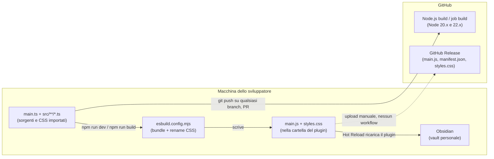

# CI/CD e rilascio

Come il codice diventa il `main.js` che Obsidian carica, cosa controlla GitHub Actions e come si pubblica una versione. Serve quando una build fallisce in CI, quando tocchi il CSS o quando devi rilasciare. La struttura del plugin sta in [01-architettura.md](./01-architettura.md).

## Il giro a colpo d'occhio

Il repo ha un solo workflow e nessun deploy automatico. La CI verifica che il codice compili e passi il lint, poi butta via il risultato. Il plugin arriva nel vault perché il repo vive già dentro `.obsidian/plugins/obsidian-better-finder/`: la build scrive `main.js` e `styles.css` direttamente dove Obsidian li legge.



La freccia tratteggiata è l'unica strada documentata per distribuire il plugin, e la dice solo un commento. `.gitignore` righe 11-13

## I job

Il workflow si chiama "Node.js build" e ha un solo job, `build`, eseguito due volte dalla matrice:

| Job | Quando parte | Cosa fa | Cosa produce |
|---|---|---|---|
| `build` (Node 20.x) | push su qualsiasi branch, PR verso qualsiasi branch | `npm ci`, `npm run build --if-present`, `npm run lint` | niente: nessun `upload-artifact` |
| `build` (Node 22.x) | come sopra | come sopra | niente |

Il file è corto e si legge tutto:

```yaml
on:
    push:
        branches: ["**"]
    pull_request:
        branches: ["**"]

jobs:
    build:
        runs-on: ubuntu-latest

        strategy:
            matrix:
                node-version: [20.x, 22.x]
                # ...
            - run: npm ci
            - run: npm run build --if-present
            - run: npm run lint
```

`.github/workflows/lint.yml` righe 3-27

Il nome del file (`lint.yml`) dice meno di quello che fa: il passo di build è il controllo più utile. `npm run build` lancia prima `tsc -noEmit -skipLibCheck`, quindi un errore di tipo blocca la CI anche se esbuild, che non controlla i tipi, produrrebbe un bundle. `package.json` riga 10

**⚠️ Trappola**: `tsconfig.json` include `**/*.ts`, quindi il type-check copre anche i file morti del template (`src/main.ts`, `src/settings.ts`) e i test in `test/`. Un errore lì rompe la CI anche se quel codice non finisce nel bundle. `tsconfig.json` righe 21-23

ESLint non è dichiarato in `devDependencies`. Arriva come dipendenza transitiva fissata nel lockfile (8.57.1), che `npm ci` rispetta. Con ESLint 8 vale `.eslintrc`; `eslint.config.mts` importa pacchetti non installati e non viene caricato. `package-lock.json` righe 2740-2742

## La build

`esbuild.config.mjs` fa un bundle di `main.ts` in `main.js` (CommonJS, target es2018). Obsidian, Electron, CodeMirror e i moduli builtin di Node restano `external`: li fornisce l'app a runtime. In sviluppo resta in watch con sourcemap inline; con l'argomento `production` minifica, fa una sola build ed esce. `esbuild.config.mjs` righe 29-65

Ogni componente importa il suo `.css` dal `.ts` ed esbuild li unisce in `main.css`. Il plugin `renameCssPlugin` lo rinomina poi in `styles.css`, l'unico file di stile che Obsidian carica:

```js
const renameCssPlugin = {
	name: "rename-css",
	setup(build) {
		build.onEnd(async () => {
			try {
				await access("main.css");
				await rename("main.css", "styles.css");
			} catch {
				// ...
			}
		});
	},
};
```

`esbuild.config.mjs` righe 15-27

**⚠️ Trappola**: `styles.css` è un artefatto di build ma è tracciato in git, mentre `main.js` no. `.gitignore` righe 11-16. Se modifichi un `.css` e committi senza aver lanciato `npm run dev` o `npm run build`, il `styles.css` nel repo resta vecchio. La CI ricostruisce ma non confronta il risultato con il file committato, quindi non se ne accorge. Non modificare `styles.css` a mano: la build successiva lo sovrascrive.

Il `catch` vuoto ignora qualsiasi errore del rename, non solo il caso "nessun CSS". Se il rename fallisce (file bloccato su Windows, permessi), la build risulta riuscita e `styles.css` resta quello vecchio.

## Gli ambienti

C'è un solo ambiente: il vault di chi sviluppa. Il repo è clonato dentro `.obsidian/plugins/` del vault. `npm run dev` ricompila a ogni salvataggio e il plugin Hot Reload lo ricarica in Obsidian. Hot Reload si attiva per la presenza di `.git` o di un file `.hotreload` nella cartella. `README.md` righe 61-75

I log del plugin si vedono nella console degli strumenti per sviluppatori di Obsidian. Non esiste uno staging né un ambiente di produzione gestito dal repo.

## Come si rilascia

Il rilascio è manuale. Il tag `1.0.0` presente nel repo viene dal template del 2020, non da un rilascio di questo plugin (`git log 1.0.0`). Passi:

1. Assicurati che il working tree sia pulito e che `npm run build` passi in locale. `npm version` rifiuta di partire con modifiche non committate.
2. Lancia `npm version patch` (oppure `minor`, `major`, o un numero esplicito). npm aggiorna `package.json`, poi esegue lo script `version`. `package.json` riga 11
3. Lo script `version` lancia `version-bump.mjs`, che copia la nuova versione in `manifest.json` e aggiunge a `versions.json` la coppia versione e `minAppVersion`. Poi fa `git add` dei due file, così entrano nel commit di versione. `version-bump.mjs` righe 3-14
4. npm crea il commit e il tag. Il tag è senza prefisso `v` (es. `1.0.1`) per `tag-version-prefix=""` in `.npmrc`, perché Obsidian cerca la release con il numero esatto di `manifest.json`.
5. Lancia `npm run build` per avere il `main.js` minificato della versione.
6. Fai push del commit e del tag (`git push --follow-tags`).
7. Su GitHub crea una release sul tag e allega a mano `main.js`, `manifest.json` e `styles.css`.

Per tornare indietro, il repo non prevede niente: si ripubblica una release precedente o si installa a mano il `main.js` di un tag vecchio nella cartella del plugin.

**⚠️ Trappola**: il README descrive `npm run version` come il comando che alza la versione, ma non la alza. `README.md` riga 58. Lanciato direttamente, lo script legge `npm_package_version`, che è la versione già in `package.json`. Riscrive quindi `manifest.json` con lo stesso numero. La versione si alza solo con `npm version <tipo>`, che chiama lo script come hook. `version-bump.mjs` riga 3

## Cosa la pipeline non fa

- **Test**: `npm test` (Jest) non gira in CI. I test esistono e si lanciano in locale, vedi [Testarlo con Jest](./07-aggiungere-un-filtro.md#testarlo-con-jest).
- **Formattazione**: `npm run format:check` esiste ma la CI non lo chiama. `package.json` riga 9
- **Release**: nessun job crea tag, release o artefatti.
- **Controllo di `styles.css`**: vedi la trappola in [La build](#la-build).

## Variabili e segreti

Il workflow non usa segreti né variabili di repository: legge solo `matrix.node-version`. Non c'è niente da configurare su GitHub per farlo girare.
