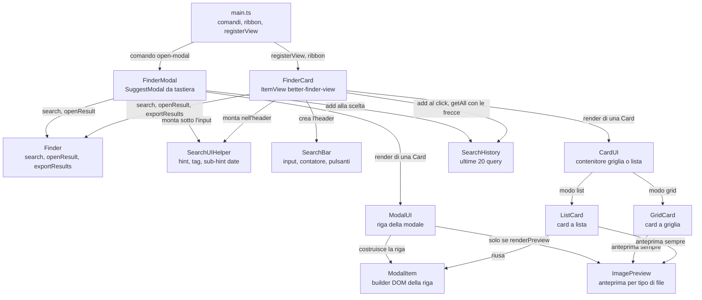

# Interfaccia: la modale e la vista laterale

Il plugin ha due interfacce che usano lo stesso motore di ricerca: una modale guidata da tastiera e una vista laterale con card. Questo capitolo dice che forma hanno, quale file disegna ogni zona e dove si comportano in modo diverso. Il percorso di una query dal tasto premuto al risultato aperto è in [02-flusso-ricerca.md](./02-flusso-ricerca.md).

## Come è organizzata l'interfaccia

I componenti costruiscono il DOM a mano, senza framework UI, con gli helper di Obsidian (`createDiv`, `createSpan`, `setCssStyles`). Ogni classe riceve l'elemento padre nel costruttore. Le due schermate sono una `SuggestModal` e una `ItemView`, le classi base che Obsidian offre per un popup di suggerimenti e per un pannello del workspace: non serve un router.

| Cosa | Dove |
|---|---|
| Modale | `src/FinderModal.ts`, righe di risultato in `src/component/Modal/` |
| Vista laterale | `src/FinderCard.ts`, card in `src/component/Card/` |
| Barra degli hint, condivisa | `src/SearchUIHelper.ts` |
| Componenti piccoli (titolo, tag, anteprime, chip) | `src/component/ui/` |
| View-model di un risultato | `Card` in `src/component/interface/Card.ts` |
| Stringhe UI in italiano | `i18n` in `src/const.ts` |

Il CSS sta accanto al componente (`HintBar.css` vicino a `HintBar.ts`) ed è importato dal `.ts`. esbuild lo raccoglie in [styles.css](./05-ci-cd.md#la-build), che è l'unico foglio di stile che Obsidian carica. Le regole della modale sono limitate alla classe `better-finder-modal`, che Obsidian non mette da solo: la aggiunge `onOpen`. `src/FinderModal.ts` righe 34-35

Il diagramma mostra cosa condividono le due UI: l'orchestratore `Finder`, la barra degli hint, il builder delle righe e la cronologia.



## Come si aprono le due schermate

Il punto d'ingresso è `main.ts`. Registra la vista con il tipo `better-finder-view`, poi i due [comandi del plugin](./04-sintassi-query.md#comandi-del-plugin): uno apre una modale nuova, l'altro attiva la vista laterale. L'icona nel ribbon, se [`showRibbonIcon`](./04-sintassi-query.md#impostazioni) è attivo, apre la vista e non la modale. `main.ts` righe 43-65

`activateFinderView` riusa la prima leaf che mostra già la vista e ne apre una nuova solo se non c'è. La vista è quindi una sola per workspace. Ogni comando della modale invece crea un'istanza nuova di `FinderModal`, e con lei di `Finder`. `main.ts` righe 161-171

## La modale di ricerca

`FinderModal` estende `SuggestModal`: Obsidian gestisce input, lista, frecce e Invio; il plugin fornisce i risultati, il rendering di ogni riga e l'azione alla scelta.

```
+---------------------------------------------+
| [ input della query                       ] |
| #  created:  modified:  >  title:  pdf ...  |  hint bar
| #spring  #java/jvm                          |  autocomplete tag
| today  yesterday ...  2026  YYYY/MM/DD      |  sub-hint date
+---------------------------------------------+
| Titolo [PDF]  data  cartella   | anteprima  |
| snippet o task   #tag   2/5    |            |
+---------------------------------------------+
```

| Zona | Dove vive nel codice |
|---|---|
| Guscio, input e lista | `SuggestModal` di Obsidian; `getSuggestions` passa la query a `Finder.search`, `src/FinderModal.ts` righe 58-60 |
| Hint bar, autocomplete tag, sub-hint date | `SearchUIHelper` inserito dopo `.prompt-input-container`, `src/FinderModal.ts` righe 34-51 |
| Riga di risultato | `renderResult` costruisce la `Card`, `src/FinderModal.ts` righe 75-103; `ModalUI.render` la disegna, `src/component/Modal/ModalUI.ts` righe 21-61 |
| Colonna anteprima | `ModalItem.setPreview` sposta il contenuto in un wrapper di testo e aggiunge la colonna a destra, `src/component/Modal/ModalItem.ts` righe 64-78 |
| Riga di comando (query con `>`) | `Finder.renderCommand` con nome, id e hotkey, `src/Finder.ts` righe 114-139 |
| Scelta | `onChooseSuggestion` salva la query in cronologia e apre il risultato, `src/FinderModal.ts` righe 70-73 |

`renderResult` gira una volta per riga visibile, ma la query è la stessa per tutta la lista. Per questo la [ParsedQuery](./02-flusso-ricerca.md#2-la-query-diventa-una-parsedquery) è memoizzata sull'ultimo input: senza cache le regex di tutti i filtri giravano N volte per tasto e la modale si bloccava sui vault grandi. `src/FinderModal.ts` righe 14-27

La decisione "questa riga ha un'anteprima?" sta nella modale, non in `ModalUI`. La modale mette nel `Card` il flag `renderPreview`, vero per le estensioni in `PREVIEW_EXTENSIONS` e per i disegni Excalidraw. `ModalUI` resta un renderer che esegue quello che trova nel `Card`, e ha la stessa regola per gli snippet: lo snippet dei task, quando c'è il filtro [task:](./04-sintassi-query.md#task), vince sullo snippet del testo libero.

```typescript
const ext = file.extension.toLowerCase();
const isExcalidraw = ext === 'md' && fileCache?.frontmatter?.['excalidraw-plugin'] === 'parsed';
const renderPreview = PREVIEW_EXTENSIONS.includes(ext) || isExcalidraw;

new ModalUI(el, this.app).render({
  file,
  tags: fileTags,
  searchedTags: parsed.tags,
  taskInfo: parsed.taskFilter ? { done: doneCount, total: tasks.length } : undefined,
  renderPreview,
  snippetTerm: ext === 'md' && parsed.freeText ? parsed.freeText : undefined,
  taskSnippet: ext === 'md' ? parsed.taskFilter : undefined,
});
```

`src/FinderModal.ts` righe 90-102

Un click su una chip dell'hint bar aggiunge l'etichetta alla query e rilancia un evento `input`, così `SuggestModal` ricalcola i risultati da sola. Un click su un valore data passa da `SearchUIHelper.toggleDateValue`, che sostituisce il valore corrente o lo toglie se è già quello. `src/FinderModal.ts` righe 105-121

La modale implementa sia `renderSuggestion` sia `renderModalItem`, ma Obsidian chiama solo il primo: su questo e su `renderPreview`, `CLAUDE.md` sbaglia (vedi le [discrepanze con CLAUDE.md](./01-architettura.md#discrepanze-fra-claudemd-e-codice)). `src/FinderModal.ts` righe 62-68

## La vista laterale

`FinderCard` è una `ItemView` con risultati a griglia o a lista, scroll infinito, cronologia con le frecce, export e menu contestuale. Ha `navigation = true`: se apri un file nella stessa leaf, il pulsante indietro di Obsidian riporta al finder. `src/FinderCard.ts` righe 25-31

```
+------------------------------------------------+
| [ Search files... ]  12 risultati  [lista] [⤓] |  SearchBar
| #  created:  modified:  >  title:  ...         |  hint bar e sub-hint
+------------------------------------------------+
| +-----------+ +-----------+ +-----------+      |
| | Titolo    | | Titolo    | | Titolo    |      |  CardUI in griglia
| | anteprima | | anteprima | | anteprima |      |
| | data #tag | | data #tag | | data #tag |      |
| +-----------+ +-----------+ +-----------+      |
|            ... sentinella dello scroll ...     |
+------------------------------------------------+
```

| Zona | Dove vive nel codice |
|---|---|
| Header: input, contatore, toggle, export | `SearchBar`, `src/component/ui/SearchBar.ts` righe 11-67; montato da `buildUI`, `src/FinderCard.ts` righe 55-78 |
| Toggle griglia o lista | `ToggleButton`, `src/component/ui/ToggleButton.ts` righe 4-33; lo ascolta `CardUI`, `src/component/Card/CardUI.ts` righe 14-24 |
| Card a griglia | `GridCard`, stili in linea, `src/component/Card/GridCard.ts` righe 19-48 |
| Card a lista | `ListCard`, riusa il `ModalItem` della modale, `src/component/Card/ListCard.ts` righe 21-48 |
| Dati di una card | `buildCardData`, `src/FinderCard.ts` righe 157-169 |
| Menu contestuale | evento nativo `file-menu`, lo stesso menu dell'esplora file, `src/FinderCard.ts` righe 171-177 |

### Scroll infinito

La vista non limita i risultati: li tiene tutti in `allResults` e ne disegna 20 alla volta. In fondo all'ultimo blocco mette un div sentinella osservato da un `IntersectionObserver`, l'API del browser che avvisa quando un elemento entra nell'area visibile. Quando la sentinella si vede, parte il blocco successivo:

```typescript
private loadMoreItems(): void {
  const batch = this.allResults.slice(this.renderedCount, this.renderedCount + PAGE_SIZE);

  batch.forEach(result => this.renderResult(result));
  this.renderedCount += batch.length;

  if (this.renderedCount < this.allResults.length) {
    this.attachSentinel();
  } else if (this.sentinel) {
    this.sentinel.remove();
    this.sentinel = null;
  }
}
```

`src/FinderCard.ts` righe 124-136

Ogni nuova ricerca stacca l'observer, svuota il contenitore e riparte da zero. `src/FinderCard.ts` righe 108-116

### Export dei risultati

Il pulsante ⤓ esporta **tutti** i risultati della ricerca, anche quelli non ancora disegnati dallo scroll. `Finder.exportResults` crea nella radice del vault una nota `Risultati ricerca <timestamp>.md` con la query, il conteggio e un wikilink con data per ogni file, poi la apre. I comandi sono esclusi; con zero file compare solo un avviso. `src/Finder.ts` righe 158-186

**⚠️ Trappola**: l'ora nel nome del file è in UTC, non quella locale. Il nome viene da `now.toISOString()`, mentre la riga della query dentro la nota usa `toLocaleString()`: a Roma in estate una ricerca delle 15:30 produce `Risultati ricerca 2026-07-14-13-30-00.md`. `src/Finder.ts` righe 167-175

### Differenze dalla modale

Le card della vista sono più povere delle righe della modale:

- niente snippet del testo libero e niente snippet dei task;
- i tag cercati non sono evidenziati, perché `searchedTags` è sempre vuoto (`src/FinderCard.ts` riga 166);
- l'anteprima c'è sempre, per ogni tipo di file;
- il badge dei task compare ogni volta che la nota ha task, non solo con il filtro `task:`.

**⚠️ Trappola**: il toggle griglia/lista non ridisegna le card. `CardUI` cambia le classi CSS del contenitore e il `mode` usato dalle card future, quindi dopo il toggle convivono card a griglia già disegnate e card a lista arrivate con lo scroll. Si allineano alla ricerca successiva. `src/component/Card/CardUI.ts` righe 19-23

**⚠️ Trappola**: una query in [command mode](./04-sintassi-query.md#comandi-obsidian) mostra i comandi anche nella vista, ma non si possono lanciare. `renderResult` li disegna in un div senza listener di click: solo i file ricevono `onOpen`. `src/FinderCard.ts` righe 138-155

**⚠️ Trappola**: la guida per gli agenti definisce `FinderCard` legacy, da non estendere senza richiesta esplicita. Però cronologia ed export esistono solo qui, e il ribbon apre questa vista. Prima di toccarla, chiarisci con il maintainer su quale delle due UI investire. `CLAUDE.md` righe 40 e 67

## Cronologia delle ricerche

`SearchHistory` tiene le ultime 20 query che hanno portato ad aprire un risultato. Una query ripetuta risale in cima invece di duplicarsi, e una query vuota non entra. È un singleton che non sa dove salvare: `main.ts` gli passa all'avvio le voci lette da `data.json` e una callback che riscrive le [impostazioni](./04-sintassi-query.md#impostazioni). `src/engine/SearchHistory.ts` righe 21-34

```typescript
SearchHistory.getInstance().init(this.settings.searchHistory, (entries) => {
  this.settings.searchHistory = entries;
  this.saveSettings().catch(console.error);
});
```

`main.ts` righe 38-41

Esempio: con la cronologia `["#spring created:this-week", "pdf contratto"]`, se riapri un risultato di `pdf contratto` la lista diventa `["pdf contratto", "#spring created:this-week"]` e `data.json` viene riscritto subito.

Entrambe le UI scrivono, ma solo la vista laterale legge. La modale aggiunge la query in `onChooseSuggestion`; la vista la aggiunge al click su una card. Nella vista, freccia su e freccia giù scorrono la cronologia come in un terminale: `historyIndex` parte da -1, freccia su va verso le query più vecchie, freccia giù torna verso l'input vuoto. `src/FinderCard.ts` righe 80-99

Il valore richiamato passa da `SearchBar.setValue`, che lancia un evento `input` sintetico e quindi una nuova ricerca. Il listener distingue i due casi con `event.isTrusted`: solo la digitazione vera azzera `historyIndex` ed esce dalla navigazione. `src/FinderCard.ts` righe 69-76

Nella modale la cronologia non si può sfogliare: le frecce le usa `SuggestModal` per muoversi fra i suggerimenti. È annotato come lavoro aperto in `TODO` riga 7.

## La barra degli hint

`SearchUIHelper` monta nello stesso contenitore tre pezzi, nell'ordine in cui compaiono:

1. `HintBar`: una chip per filtro, con la `label` come testo e la `desc` come tooltip. L'ordine è quello di registrazione dei filtri nella factory.
2. `TagsPreview`: mentre scrivi un [#tag](./04-sintassi-query.md#tag), mostra i primi 20 tag del vault che iniziano così, ordinati per frequenza.
3. `HintBarSub`: i valori di [created: e modified:](./04-sintassi-query.md#date) più l'anno corrente, visibile solo quando la query contiene uno dei due prefissi.

`src/SearchUIHelper.ts` righe 28-45

`HintBarSub` non conosce i filtri: i valori glieli passa `SearchUIHelper` da `DATE_VALUES` di `DateFilter`. Così aggiungere un valore data non tocca la UI. Come dare chip e sub-hint a un filtro nuovo è spiegato in [Hint e sub-hint nella UI](./07-aggiungere-un-filtro.md#hint-e-sub-hint-nella-ui).

**⚠️ Trappola**: una chip si accende se la sua etichetta compare come sottostringa nella query, non se il filtro è stato riconosciuto. `-` si accende con `this-week`, `base` con `database`, `#` con qualsiasi tag. `src/Finder.ts` righe 59-65
