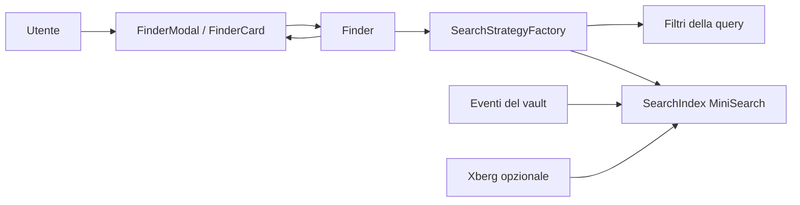

# Wiki del Progetto: Obsidian Better Finder

> Documentazione tecnica generata automaticamente. Aggiornata al: 2026-10-09

## Indice

- [Panoramica architettura](./01-architettura.md): il giro completo del plugin, i moduli, lo stack
- [Flusso: ricerca dalla modale](./02-flusso-ricerca.md): da una query digitata al file aperto
- [Flusso: indicizzazione all'avvio e aggiornamento live](./03-flusso-indicizzazione.md): indice MiniSearch, cache dei tag dei canvas, testo estratto da Xberg
- [Sintassi della query, comandi e impostazioni](./04-sintassi-query.md): ogni filtro con esempi, i comandi del plugin, `data.json`
- [Build, CI e rilascio](./05-ci-cd.md): esbuild, il workflow GitHub Actions, come si pubblica una versione
- [Interfaccia](./06-interfaccia.md): la modale, la vista laterale e i componenti condivisi
- [Aggiungere un filtro alla query](./07-aggiungere-un-filtro.md): la guida passo per passo

## Il sistema in un colpo d'occhio

Better Finder è un plugin Obsidian che sostituisce la ricerca rapida con una query unica. Nella stessa riga si mescolano filtri (`#tag`, `created:this-week`, `pdf`, `path:`, `-image`) e testo libero. La query passa da una catena di filtri e poi dall'indice full-text MiniSearch, costruito all'avvio e tenuto allineato dagli eventi del vault. I risultati si aprono da una modale guidata da tastiera o da una vista laterale a griglia o lista.

## Da dove partire

| Se vuoi... | Leggi |
|---|---|
| capire cosa succede quando l'utente digita una query | [Flusso: ricerca](./02-flusso-ricerca.md) |
| sapere quali filtri esistono e come si scrivono | [Sintassi della query](./04-sintassi-query.md) |
| aggiungere un nuovo filtro | [Aggiungere un filtro](./07-aggiungere-un-filtro.md) |
| capire perché un file non compare nei risultati di testo libero | [Flusso: indicizzazione](./03-flusso-indicizzazione.md) |
| modificare come appare un risultato | [Interfaccia](./06-interfaccia.md) |
| compilare, testare e rilasciare una versione | [Build, CI e rilascio](./05-ci-cd.md) |

## Stack tecnologico

| Componente | Tecnologia |
|---|---|
| Piattaforma | Plugin Obsidian (API `obsidian` 1.12.3) |
| Linguaggio | TypeScript 4.7 |
| Ricerca full-text | MiniSearch 7.2 |
| Estrazione testo da PDF, immagini e Office | Binario esterno Xberg / kreuzberg (opzionale) |
| Build | esbuild 0.17 |
| Test | Jest 29 |
| CI | GitHub Actions (build e lint su Node 20 e 22) |

## Altri documenti

- [Domain Docs](./agents/domain.md): come le skill degli agenti leggono `CONTEXT.md` e gli ADR del repo.
- [Issue tracker: GitHub](./agents/issue-tracker.md): dove stanno le issue (`faienz93/obsidian-better-finder`) e come si usano con `gh`.
- [Triage Labels](./agents/triage-labels.md): le cinque etichette di triage usate dalle skill e il loro significato.

## Versione navigabile

[WIKI.html](./WIKI.html) contiene tutta la wiki in un file solo, con ricerca e diagrammi disegnati, e si apre senza rete.
[La mappa interattiva del sistema](./MAPPA.html) mostra moduli e dipendenze, e percorre ogni flusso passo per passo con il codice di ciascun passo.
